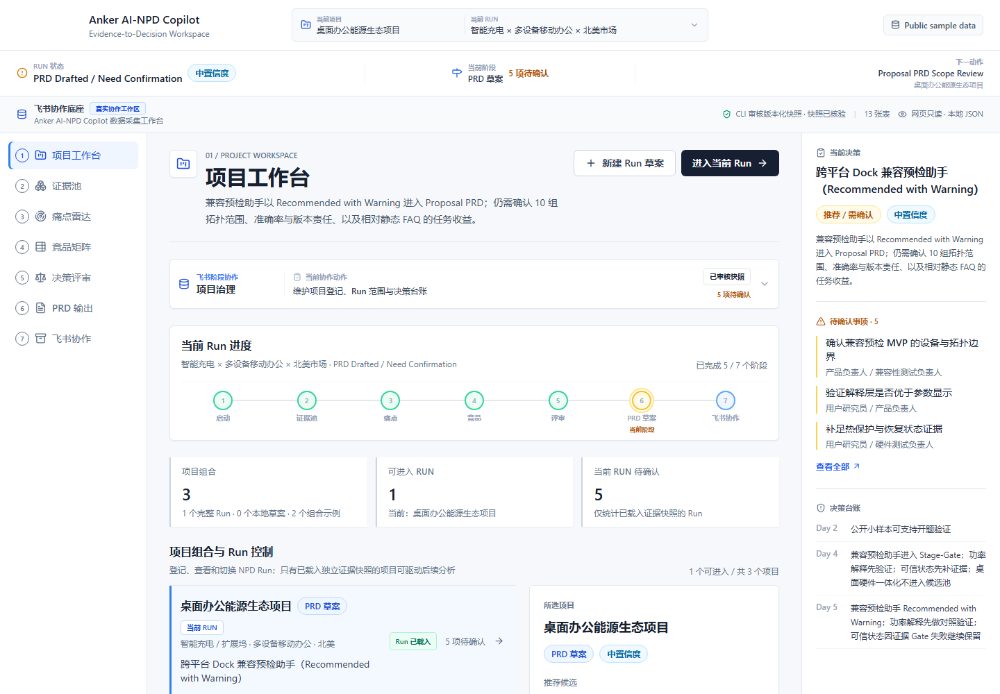
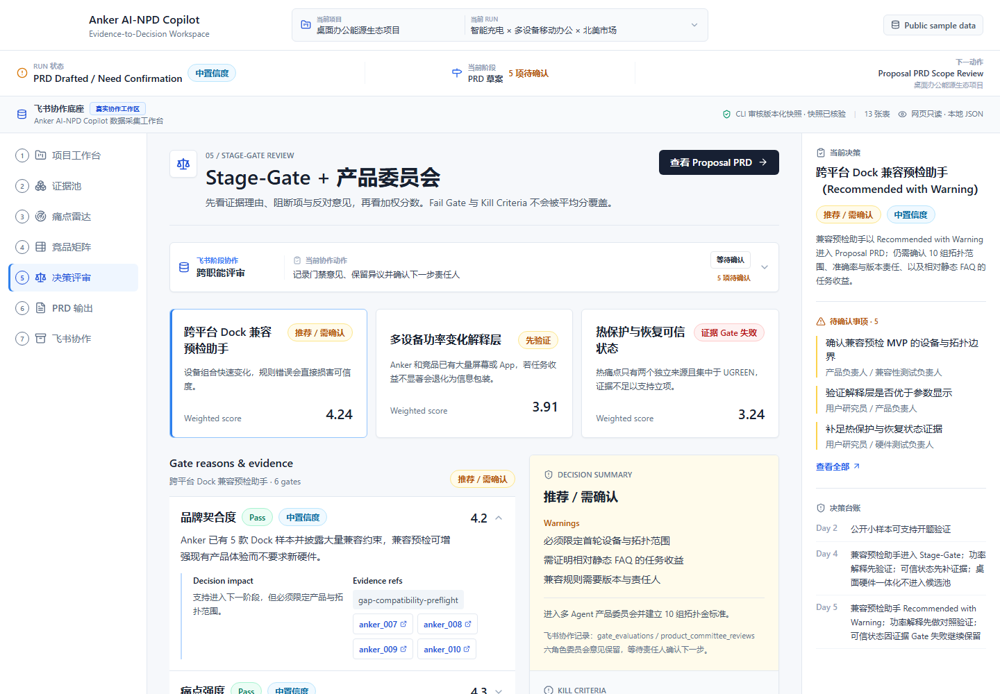
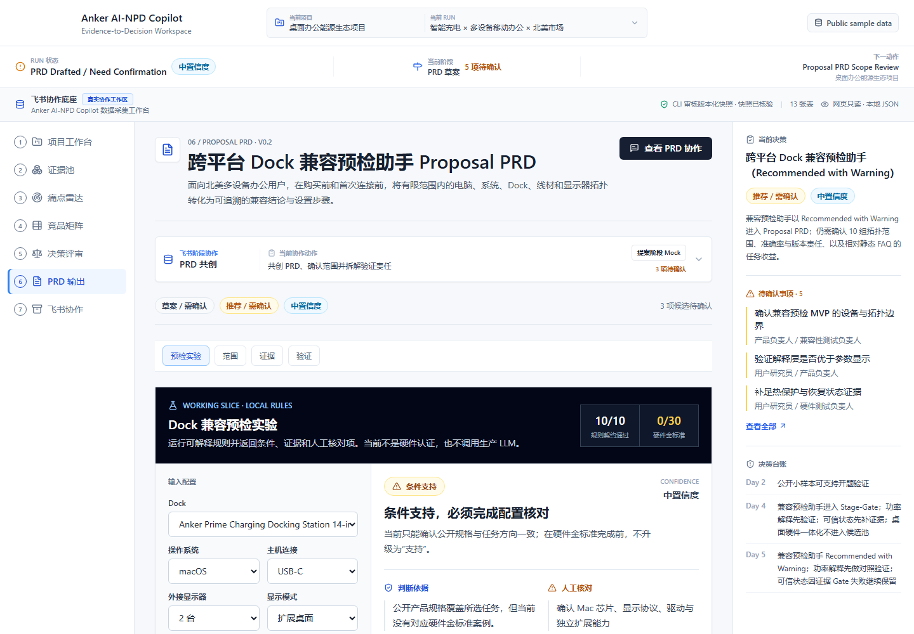

# Anker AI-NPD Copilot

> **From public evidence to reviewable new-product decisions.**<br>
> 从公开证据到可复核的新品立项决策。

Anker AI-NPD Copilot is an evidence-driven AI-NPD decision workspace developed by a three-member team for the 2026 AI Future Talent Competition and continued as a post-competition engineering case study. It turns public product facts, user feedback and review evidence into bounded opportunities, Stage-Gate decisions, opposing-agent reviews and a proposal-stage PRD.

Anker AI-NPD Copilot 是一个由三人团队完成的证据链驱动 AI-NPD 决策工作台。项目不直接“生成一款新品”，而是把公开产品事实、用户反馈和测评证据转化为有边界的机会方向、Stage-Gate 结论、反方评审和 Proposal PRD。

**[Open Live Demo](https://lesserafim4ever0502.github.io/Anker_AI_NPD_Copilot/)** · **[Project Postmortem](docs/COMPETITION_POSTMORTEM.md)** · **[Evidence Data](src/data)**



## Project Outcomes / 项目成果

| Delivered outcome | Verified scope |
| --- | ---: |
| Runnable decision workspace / 可运行决策工作台 | **7 pages** |
| Public product evidence / 公开产品证据 | **30 records** |
| Portfolio coverage / 产品覆盖 | **12 Anker + 18 competitors** |
| Reviewed public feedback / 已审核公开反馈 | **13 records** |
| Opportunity funnel / 机会漏斗 | **5 pain clusters → 4 gaps → 3 candidates** |
| Stage-Gate review / 门禁评审 | **18 Gate evaluations + 6 committee roles** |
| Feishu collaboration assets / 飞书协作资产 | **13 Base tables + 2 documents** |
| Compatibility validation plan / 兼容性验证计划 | **10 topologies × 3 tasks = 30 planned cases** |

> These are reviewed public small-sample records for workflow validation, not a market-wide conclusion or Anker internal data. The hardware gold-standard set remains explicitly at **0 / 30 verified cases**.
>
> 以上数据是用于验证工作流的公开小样本，不代表完整市场结论，也不包含安克内部数据。硬件金标准仍明确为 **0 / 30 已验证案例**。

## Why It Is Different / 核心差异

| Prompt-to-idea workflow | Anker AI-NPD Copilot |
| --- | --- |
| Generates one polished concept quickly | Preserves several candidates before commitment |
| Hides rejected alternatives and uncertainty | Keeps warnings, failed Gates and pending confirmations visible |
| Produces an answer without a traceable basis | Links decisions back to product, feedback and review evidence |
| Ends at a document | Carries owners, review states and artifacts into Feishu collaboration |

The core method is **Evidence-to-Decision**:

```text
Task framing
  → reviewed evidence pool
  → pain radar
  → opportunity and overlap map
  → three candidate directions
  → Stage-Gate + opposing-agent review
  → bounded Proposal PRD
  → Feishu collaboration and validation tasks
```

系统价值不在于让 AI 替团队拍板，而在于让每次从证据到判断的跃迁都能够被查看、质疑、降级或否决。

## Decision Snapshot / 决策结果

The current reviewed Run does not force every candidate into a positive conclusion:

| Candidate | Score | Decision | Main boundary |
| --- | ---: | --- | --- |
| Cross-platform Dock compatibility pre-check | **4.24 / 5** | Recommended with Warning | Freeze the first device/topology scope and prove value beyond a static FAQ |
| Explainable multi-device power allocation | **3.91 / 5** | Validate Before Decision | Existing display/App supply is crowded; explanation must improve a real task |
| Trustworthy thermal and recovery state | **3.24 / 5** | Failed Evidence Gate | Only two independent sources support the core thermal pain |



The selected output is a **Cross-platform Dock Compatibility Pre-check Assistant**, expressed as a bounded Proposal PRD rather than a universal compatibility promise. Page 6 includes a local deterministic rule slice, ten rule-contract checks and a validation operations console. Passing the rule contracts does **not** count as hardware validation.



## Evidence You Can Inspect / 可核验的证据

The repository keeps the evidence and decisions inspectable instead of presenting only screenshots:

| Evidence layer | Direct file |
| --- | --- |
| 12 Anker products with public source URLs | [`src/data/products.json`](src/data/products.json) |
| 18 competitor products across five brands | [`src/data/competitorProducts.json`](src/data/competitorProducts.json) |
| 13 reviewed public feedback records | [`src/data/feedback.json`](src/data/feedback.json) |
| Pain clusters and source references | [`src/data/painPoints.json`](src/data/painPoints.json) |
| Opportunity gaps and overlap warnings | [`src/data/opportunityGaps.json`](src/data/opportunityGaps.json) |
| Three candidate directions | [`src/data/candidates.json`](src/data/candidates.json) |
| 18 Stage-Gate evaluations | [`src/data/gateEvaluations.json`](src/data/gateEvaluations.json) |
| Six-role committee review | [`src/data/agentEvaluations.json`](src/data/agentEvaluations.json) |
| Proposal PRD and limitations | [`src/data/proposalPrd.json`](src/data/proposalPrd.json) |
| Compatibility rules and evidence links | [`src/data/compatibilityRules.json`](src/data/compatibilityRules.json) |
| Planned gold-set protocol | [`src/data/validationProtocol.json`](src/data/validationProtocol.json) |

The intake pipeline separates public-source collection, AI-assisted structuring and human review. Unknown values remain unknown; one row represents one product or feedback record, and accepted product records retain a public `sourceUrl`.

## Feishu Collaboration Boundary / 飞书协作边界

Feishu is treated as the organizational collaboration layer, not as a final export button. The project deliberately distinguishes three implementation states:

| State | What is real |
| --- | --- |
| **Real cloud assets** | Data-collection Base, 13 Base tables, intake guide and Proposal PRD document |
| **Reviewed local snapshot** | CLI-reviewed, versioned JSON consumed by the browser demo |
| **Proposal-stage Mock** | Task, meeting and knowledge-base write-back structures; no live frontend API |

The public, non-sensitive workspace manifest is available at [`data_workbench/feishu_workspace_manifest.json`](data_workbench/feishu_workspace_manifest.json). Tokens, cookies, private exports and internal resource identifiers are intentionally excluded from Git history.

## Technical Details / 技术细节

### 1. 项目定位

Anker AI-NPD Copilot 不是普通 AI 聊天机器人，也不是一次性新品创意生成器。它是一套面向安克消费电子新品定义场景的 **Evidence-to-Decision** 工作台，通过公开小样本证据池、用户痛点雷达、竞品机会矩阵、Stage-Gate 门禁、多 Agent 产品委员会、样例 NP PRD 摘要与飞书协同沉淀，帮助产品团队把新品定义从经验驱动升级为证据链驱动。

### 2. Demo 主流程

1. 项目工作台 / 项目启动页：管理多个 NPD 项目、登记浏览器本地 Run 草案，并进入具备独立审核快照的当前主 Run。
2. 证据池概览页：展示公开小样本证据池、数据来源、证据链和数据缺口。
3. 用户痛点雷达页：从用户反馈中提炼痛点标签、严重度和设计信号。
4. 竞品机会矩阵页：结合产品矩阵和痛点信号识别机会空白与重叠风险。
5. Stage-Gate + 多 Agent 评审页：对 3 个候选 NP 做门禁评审、反方质疑和推荐判断。
6. 样例 NP PRD 摘要输出页：运行可解释的本地兼容预检规则切片，并通过验证运营控制台登记金标准或 FAQ 对照的本地待复核观测，再查看结构化 PRD 草案、风险和验证计划。
7. 飞书协作全景页：汇总前六页已发生或计划发生的飞书协作、任务、会议和知识资产，不把飞书表现为流程末端。

### 3. 当前推荐 Demo 状态

当前主项目建议呈现为：

```text
Run Status: PRD Drafted / Need Confirmation
Project: 桌面办公能源生态项目
Run: 智能充电 × 多设备移动办公 × 北美市场
Recommended Candidate: 跨平台 Dock 兼容预检助手（Recommended with Warning）
Confidence: Medium
Next: Product Review Meeting
```

已完成：分析边界定义、证据池构建、痛点聚类、竞品机会识别、候选 NP 评审、PRD 摘要草案。

待确认：与安克现有 SKU 的差异边界、用户付费意愿、MVP 硬件复杂度。

### 4. 仓库结构

```text
.
├── README.md
├── AGENT.md
├── SPEC.md
├── STATE.md
├── DECISIONS.md
├── DESIGN.md
├── review_index.json
├── docs/
│   ├── SYSTEM_PRD.md
│   ├── UX_PAGE_DETAILS.md
│   ├── NPD_RUN_LIFECYCLE.md
│   ├── ROLE_JOURNEYS.md
│   ├── DECISION_LOGIC.md
│   ├── FEISHU_COLLABORATION.md
│   ├── DATA_SCHEMA.md
│   ├── DATA_INTAKE.md
│   ├── EVIDENCE_AGENT_PROMPT.md
│   ├── EVIDENCE_TO_DECISION.md
│   ├── PROMPT_CONTRACTS.md
│   ├── DEMO_SCRIPT.md
│   ├── REPORT_OUTLINE.md
│   ├── ENTERPRISE_VALUE.md
│   ├── DEVELOPMENT_PLAN.md
│   ├── COMPETITION_POSTMORTEM.md
│   └── CHANGELOG.md
├── data_templates/
│   ├── *.json
│   ├── raw_evidence_intake.csv
│   ├── structured_evidence_template.csv
│   ├── evidence_intake_examples.csv
│   └── evidence_schema.json
├── submission_templates/
│   └── *.md
└── assets_placeholder/
    └── README.md
```

### 5. Agent-ready 仓库规范

本项目采用 Human-readable + Agent-readable 双通道设计：

- `README.md`：给人类评委、队友和开发者快速理解项目。
- `AGENT.md`：给 AI Agent 作为第一入口，明确项目边界、开发规则、目录结构、页面流和不可破坏的设计约束。
- `SPEC.md`：项目单一事实源。
- `STATE.md`：当前项目状态和下一步。
- `DESIGN.md`：交互网页设计规范。
- `review_index.json`：供自动审阅、摘要与 Agent 快速建模的结构化索引。

后续让 AI Agent 开发时，第一步必须读取：

```text
AGENT.md
SPEC.md
DESIGN.md
docs/SYSTEM_PRD.md
docs/UX_PAGE_DETAILS.md
docs/DATA_SCHEMA.md
docs/COMPETITION_POSTMORTEM.md
```


### 6. 数据采集自动化入口

本仓库已内置 Evidence Intake Pipeline，用于把复杂的数据筛选规则自动化。团队成员只需要先填最小原始证据表，后续由 AI / Agent 完成筛选、打分、标签、页面映射和结构化输出。

核心文件：

```text
docs/DATA_INTAKE.md
docs/EVIDENCE_AGENT_PROMPT.md
data_templates/raw_evidence_intake.csv
data_templates/structured_evidence_template.csv
data_templates/evidence_intake_examples.csv
data_templates/evidence_schema.json
```

推荐流程：

```text
队友填 raw_evidence_intake.csv
  → 使用 EVIDENCE_AGENT_PROMPT.md 批量筛选
  → 输出 structured_evidence_template.csv
  → 人工复核 include / high-value maybe
  → 转成 src/data/*.json
  → 供 Page 2–7 消费
```

原则：输入证据使用可追溯公开数据；标签、评分、页面映射由 AI 半自动生成并经人工复核。飞书采集 Base 和两份文档已真实创建；网页读取 CLI 审核后的本地快照，任务、会议和知识库回写仍为 Proposal-stage Mock，不接真实前端 API。

### 7. 技术栈 / Stack

当前工程：

```text
Vite + React + TypeScript + Tailwind CSS
本地 JSON 数据
无真实后端
无真实登录
无真实爬虫
无真实飞书 API 强依赖
```

当前 Demo 使用本地 JSON 展示飞书贯穿项目治理、证据审核、洞察复核、评审、PRD 共创和验证协作的完整流程；飞书 CLI 用于维护协作工作台和审核快照，不作为浏览器运行时依赖。

### 8. MVP 边界

报名 Demo 当前必须明确：

- 候选 NP 可用本地 JSON 预置，视觉上表现为“基于当前证据池预生成”。
- PRD 输出是草案，不是最终立项文件。
- 必须区分真实飞书资产、已审核快照与 Proposal Mock；不得用统一“同步成功”状态混淆边界。
- 不要把 NPD 表达成一键完成。系统应该保留 Warning、Pending Confirmation、Review Meeting 和 Validation Tasks。
- 规则契约通过不等于硬件兼容验证；只有进入人工金标准集的案例才能升级为“支持”。

### 9. Sites 开发入口 / Sites Entry Point

Sites 开始前必须读取：

```text
AGENT.md
SPEC.md
STATE.md
DESIGN.md
docs/SITES_HANDOFF.md
docs/DEMO_SCRIPT.md
docs/DATA_SCHEMA.md
```

直接沿用现有 `src/`、路由和 `src/data/*.json` 实现七页可交互 Demo。优先保证叙事、状态和证据引用准确，再完成响应式视觉与交互验证。

Sites must preserve the existing project structure and JSON contract, implement all seven routes, and keep Warning, Pending Confirmation, Decision Ledger, and page-level Feishu collaboration context visible throughout the demo.

### 10. 投稿前验证 / Submission Validation

```bash
npm run validate
npm run build
```

`npm run validate` 会检查七页路由、核心数据数量、冻结决策、Run 快照绑定、公开来源 URL、敏感本地 manifest 忽略规则和空文件。完整投稿状态见 `docs/SUBMISSION_READINESS.md`。
